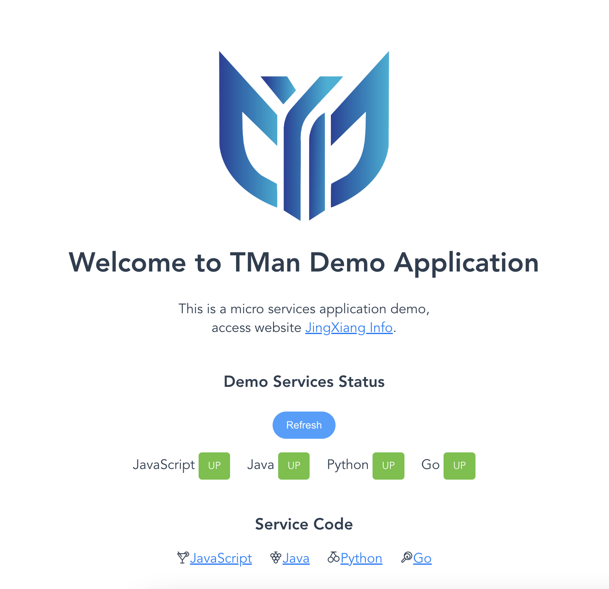

# Frontend NPM Build Demo

## 如何编译构建

```bash
docker build -t tman-demo-service:js .
```

## 如何运行服务

```bash
docker run -d -p 8080:80 -it tman-demo-service:js
```

## 如何访问服务

浏览器访问 `http://127.0.0.1:8080`

## 如何部署所有的服务



```bash
docker-compose -f compose.yaml pull
docker-compose -f compose.yaml up -d 
docker-compose -f compose.yaml ps
```

compose.yaml 如下:
```yaml
version: '2'
services:
  tman-demo-svc-js:
    container_name: tman-demo-svc-js
    image: bxwill/tman-demo-service:js
    ports:
      - 8080:80
  tman-demo-svc-java:
    container_name: tman-demo-svc-java
    image: bxwill/tman-demo-service:java
    ports:
      - 8081:8080
  tman-demo-svc-python:
    container_name: tman-demo-svc-python
    image: bxwill/tman-demo-service:python
    ports:
      - 8082:8080
  tman-demo-svc-go:
    container_name: tman-demo-svc-go
    image: bxwill/tman-demo-service:go
    ports:
      - 8083:8080
```
